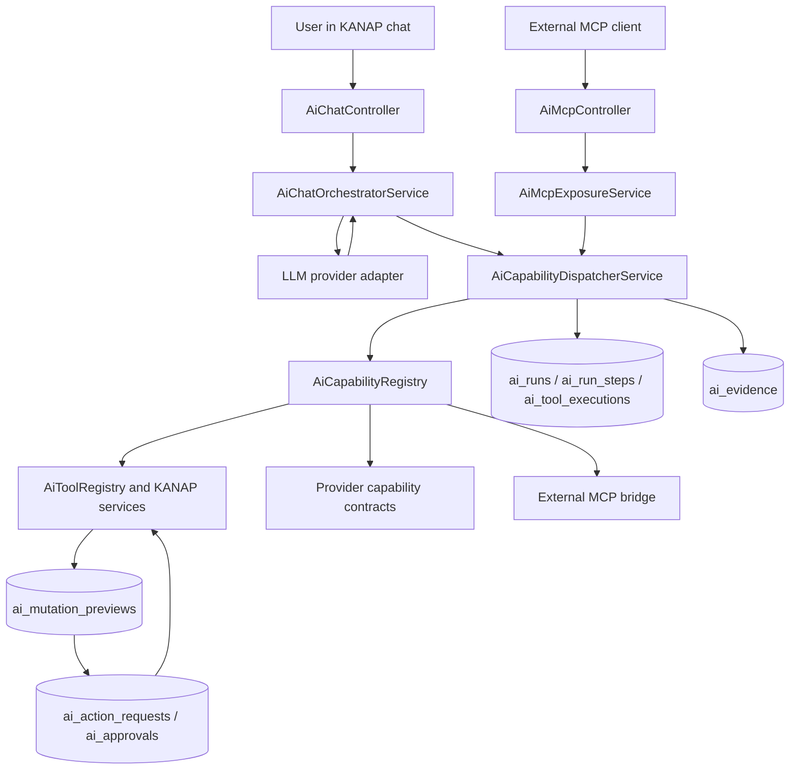

# Plaid Architecture

Metadata
- Purpose: Explain how Plaid is implemented as KANAP's AI agent and agentic control plane
- Audience: Engineers, architects, technical IT leaders
- Status: current
- Owner: Engineering
- Last Updated: 2026-06-13

**Related Documentation**:
- [architecture.md](architecture.md) - Overall KANAP architecture, tenancy, RLS, and runtime model
- [features/components/plaid-read-coverage-review.md](features/components/plaid-read-coverage-review.md) - Plaid read coverage

---

## Summary

Plaid is the native AI agent in KANAP. It uses the governed IT system of record
as its context, exposes typed tools to the model, executes those tools through
tenant-scoped services, and gates mutations through durable previews and
approvals. The control-plane layer records runs, steps, tool executions,
evidence, action requests, approvals, policy decisions, and external capability
contracts so Plaid can move from "answering questions" toward governed action
across the IT environment.

## Core Idea

An IT agent is only dependable when it can reason from a trustworthy source of
truth. KANAP is that source of truth: budgets, applications, assets, interfaces,
connections, projects, requests, tasks, suppliers, contracts, locations, and
knowledge all live in one tenant-isolated model.

Plaid does not bypass that model. It reads through typed AI tools, uses the same
RBAC and RLS boundaries as the application, and writes through preview objects
that must be approved before execution. That is the difference between a clever
assistant and an operational agent: the agent can act because the action is
grounded, scoped, reviewable, and auditable.

## Architecture At A Glance

The same dispatcher path is used from chat and MCP in the current
implementation. Chat can use read and write-preview capabilities. KANAP MCP
only exposes read-only capabilities today.

## Chat Runtime

The chat endpoint is `POST /ai/chat/stream` in
`backend/src/ai/ai-chat.controller.ts`. It builds an AI execution context with
tenant, user, request, and surface metadata, then delegates to
`AiChatOrchestratorService`.

The orchestrator:

- validates chat access through `AiPolicyService`
- resolves the provider source, model, API key, and endpoint from tenant or
  platform AI settings
- loads conversation history, user profile context, attachments, and pending
  previews
- selects a context profile from the latest turn, for example read, entity
  inspection, document write, task write, financial write, relation write, or
  web
- builds the system prompt with current user context, readable entity types,
  tool guidance, write-preview guidance, and writable field summaries
- streams the model response and buffers provider-native tool calls
- executes each tool call through `AiCapabilityDispatcherService`
- injects tool results, preview events, context items, activity events, and final
  assistant text back into the stream

The loop is bounded by `MAX_TOOL_ITERATIONS = 20`. Tool schemas are filtered by
the context profile so the model sees the smallest useful tool surface for the
turn.

## Context Engineering

Plaid context comes from the system of record, not a free-form database dump.
The main context layers are:

- **Current user and tenant context** from the authenticated request.
- **Readable entity types** from `AiPolicyService.listReadableEntityTypes`.
- **Conversation history and previews** from `AiConversationService` and
  `AiMutationPreviewService`.
- **Structured read tools** from `AiToolRegistry`, `AiQueryExecutor`, and
  `AiAggregateExecutor`.
- **Relationship context** from `AiEntityService.getEntityContext`.
- **Knowledge context** from `KnowledgeService`, including document search and
  document detail DTOs.

The query executor strips internal fields such as tenant IDs, object keys, file
paths, secrets, tokens, API keys, and encrypted fields before returning detail
payloads to the model.

## KANAP Data Tools

Plaid can currently read these entity families:

`accounts`, `analytics_categories`, `applications`, `assets`,
`business_processes`, `capex_items`, `chart_of_accounts`, `companies`,
`connections`, `contacts`, `contracts`, `departments`, `documents`,
`interfaces`, `locations`, `projects`, `requests`, `spend_items`, `suppliers`,
`tasks`, and `users`.

The core read tools are:

- `search_all`
- `describe_entity_filters`
- `query_entities`
- `aggregate_entities`
- `get_filter_values`
- `get_application_classification_catalog`
- `get_entity_detail`
- `get_entity_context`
- `get_entity_comments`
- `search_knowledge`
- `get_document`
- `web_search`, when the feature and tenant setting are enabled

Structured query and aggregate tools are authoritative for counts, filters, and
complete lists. Discovery tools are intentionally treated as ranked and
incomplete.

`search_all` and the chat @-mention picker read the `search_index` table. Each
hit carries a few metadata keys from the row's `extra_json`, listed per entity
type in `SEARCH_INDEX_METADATA_KEYS` (`ai-entity.service.ts`). OPEX and CAPEX
lines (`spend_items`, `capex_items`) are also found by the names of their
analytics values, accent-insensitive, on the enabled dimensions used for the
line's type (the ones its drawer shows). Dimension names are not indexed. Their
`analytics` key lists the values the line holds, in dimension order, for
example `Nature de coût: Matériel; Récurrence: Récurrent` (null when the line
holds none). Triggers on the line's values, on value names and on dimensions
keep these entries current (migration `1853940000000`; see "Knowledge" in
`architecture.md`).

Application classification has a dedicated catalog read. `get_application_classification_catalog`
uses the tenant and `applications:reader` scope and returns business levels
(with the optional downtime that documents each level), cyber levels, data
classes, recovery waves, explicit ranks/orders and deprecation flags, ordered
from most to least severe. It is authoritative for labels and ranks;
`get_filter_values` only reports values observed on accessible applications.
Application queries can filter, sort, group, aggregate, and count business
level/rank, cyber level/rank, data class, recovery wave/order, RTO, RPO, and
review state.

## Write Model

Plaid writes are chat-only. The model cannot execute a mutation directly.
Instead, a write tool creates a backend preview. The user then approves or
rejects that preview through the chat approval card. Approval is recorded as a
durable action request and approval row before execution.

Live write-preview coverage includes:

- task creation, status updates, assignee changes, richer task field updates,
  task comments, and bulk task reassignment previews
- document creation, content updates, metadata updates, and relation updates
- master-data create/update for companies, departments, suppliers, contacts,
  accounts, charts of accounts, analytics categories, business processes, and
  locations
- business-record create/update for applications, assets, contracts, projects,
  requests, interfaces, connections, spend items, and CAPEX items
- relation updates for supported application, asset, supplier, contract, spend,
  CAPEX, project, request, document, and location links
- financial plan writes for spend and CAPEX versions, amounts, and allocations
- GLPI ticket import into a KANAP task
- grouped mutation plans and undo previews where a reversible operation supports
  reversal

Application classification create/update previews use the normal application
mutation service. They can set or clear business criticality, cyber,
confidentiality, recovery wave, RTO/RPO and justification, by tenant code or
exact label; a downtime mentioned by the user maps to the level whose
definition covers it, never to an application field. The preview flags when an
existing human review becomes stale. Plaid cannot edit classification catalogs,
publish settings, or implicitly mark an application reviewed.

Budget-line previews (spend and CAPEX) also write analytics dimensions. The model
addresses a dimension as `analytics:<code>` (code matched case-insensitively and
parsed before the usual field-key normalisation); the default dimension keeps
`analytics_category` and also answers to `analytics:<its code>`, so a double
address is caught by the "provided more than once" check. The value is given by
name or id and is looked up within the addressed dimension only, so a name that
exists in two dimensions is never ambiguous; `null` or an empty value clears it.
The preview checks what the write gate checks and reuses its messages
(`item-analytics.util.ts`): an unknown, disabled or other-type dimension and a
disabled or other-type value are refused at once, except when the request leaves
the line's current value unchanged. `mutation_input.fields` stores each
dimension under `analytics_axis:<axis id>`, never the code, so a rename between
preview and apply changes nothing and undo keeps working. `field_labels` holds
the dimension's display name (the tenant's name for it, "Analytics dimension"
when an unnamed default has none) and `display_values` the value names, the
previous one included. Apply translates these keys into `analytics_values`
(`{ [axisId]: categoryId | null }`) for the spend and CAPEX services, and the
edit-conflict check compares each dimension with the live line's value on that
axis. The system prompt lists each enabled dimension once, with the line types it
applies to among those the user can read (`analytics_dimensions`: `key`, `name`,
`default`, `used_for`, `required`), built by `ai-analytics-dimensions-context.ts`.
`required` is the dimension's setting (a listed dimension is enabled and applies to
each `used_for` type), and the prompt says a required dimension must be given a
value when creating a line. The create preview refuses a line missing a value on a
dimension required for its type ("Nature is required for spend item creation.",
"… for CAPEX item creation.", with the label the preview uses), through
`missingRequiredDimensions`; the update preview refuses a `null` on a required
dimension the line holds, with the write gate's message ("The Nature dimension is
required. Choose a value."). The write gate checks both again at apply. Creating a
value in a chosen dimension is a master-data create of `analytics_categories`
with the field `dimension`. It accepts the dimension's code, its `analytics:<code>`
key or its name, and for the default dimension also `analytics_category` or its
reserved label. The preview refuses a disabled dimension and a value `applies_to`
that conflicts with the dimension, before approval. On update, `dimension` naming
the value's current dimension is a no-op; any other is refused, since a value
never moves.

Writes go through existing domain services where practical, so normal validation,
workflow rules, side effects, and audit logging still apply. AI-originated domain
audit rows use `source: ai_chat` and the preview ID as `sourceRef`.

## MCP Exposure

KANAP exposes an MCP endpoint at `POST /ai/mcp` using stateless Streamable HTTP.
MCP API keys can be sent as `Authorization: Bearer <key>` or `x-api-key`.

Current MCP behavior is deliberately read-only:

- API keys have scoped policies: `mcp:tools:list`, `mcp:tools:execute`, and
  optionally `mcp:audit:read`
- default allowed capability group is `kanap.read.core`
- API key policy enforces `mcp_max_effect = read`
- `AiMcpExposureService` only exposes capabilities whose effect is `read`,
  default approval is `none`, and MCP exposure is marked read-only
- MCP calls are dispatched through the same control-plane dispatcher and are
  recorded in `ai_runs`, `ai_tool_executions`, and `ai_evidence`
- `GET /ai/mcp/audit` returns MCP tool execution audit entries for authorized
  keys/admins

Read-write MCP is roadmap. It needs an explicit approval protocol rather than
reusing chat approval cards.

## Agentic Control Plane

The control plane generalizes Plaid tools into capability contracts. A
capability declares:

- name and version
- provider kind
- supported surfaces: chat, MCP, scheduler, alert, or internal
- input and output schemas
- effect: read, propose, notify, write, or remediate
- risk level and maximum autonomy level
- approval strategy
- evidence persistence and redaction rules
- timeout, retry, idempotency, rollback, and MCP exposure metadata

`AiCapabilityRegistry` wraps existing KANAP AI tools as compatibility
capabilities and also registers provider capability contracts for monitoring,
ticketing, virtualization, directory, automation, and external MCP tools.
`AiCapabilityDispatcherService` validates inputs, enforces surface and approval
rules, checks emergency pauses, executes the handler, records evidence, and
updates run/step/tool status. The handler runs under its own savepoint: when one
of its statements fails, only its work is rolled back, the failure is recorded
with the original error, and later capabilities in the same transaction still
run.

The main durable records are:

- `ai_runs`
- `ai_run_steps`
- `ai_tool_executions`
- `ai_evidence`
- `ai_action_requests`
- `ai_approvals`
- `ai_observations`
- `ai_recommendations`
- `ai_decisions`
- `ai_evaluations`
- `ai_approval_policies`
- `ai_autonomy_ceilings`
- `ai_autonomy_routines`
- `ai_emergency_pauses`
- `ai_automation_job_catalog`
- `ai_external_mcp_servers`
- `ai_external_mcp_tool_snapshots`
- `ai_live_test_targets`

These tables are tenant-scoped and RLS-protected in the corresponding
migrations.

### Per-agent knowledge and web sources

Each agent carries a knowledge-and-web-sources policy on its scope configuration,
separate from the tenant-wide AI settings. The policy controls where the agent
looks for answers when it triages work:

- **KANAP knowledge** can be on or off. When on, the agent searches either every
  knowledge library it may read or a chosen subset. A chosen subset is always
  intersected with the libraries the agent's configuring administrator can read,
  so scoping an agent down never widens its access. When off, the orchestrator
  skips the knowledge search entirely and the agent relies on the model — and on
  the web, if web search is enabled.
- **Web search** can be on or off, independent of the chat web-search toggle. It
  only takes effect when the platform has a web-search provider configured
  (`AI_WEB_SEARCH_READY`, i.e. `BRAVE_SEARCH_API_KEY` is present); otherwise the
  agent setting is inert and the corresponding UI control is disabled.

When both run, **KANAP knowledge always takes precedence.** Web search runs
through a governed internal `web_search` capability whose `provider_kind` is
`web`, so the dispatcher grades its evidence as `external` trust — never the
`system` trust reserved for `kanap_domain` providers — and web findings can never
outrank internal knowledge. Web results only augment gaps: in the internal triage
note they appear in a separate "external, unverified" section below the knowledge
references, and in a requester-facing reply they are used only when no knowledge
matched, and are always cited with their source URL. The `web_search` capability
is internal-surface, read-effect, autonomy `A1`, no approval, and is not exposed
over MCP. Its handler reuses `BraveSearchService`, which strips internal
identifiers (UUIDs, reference codes, emails, internal hostnames) from the query
and refuses to run if nothing public-meaningful remains, so no tenant-internal
data leaves the control plane. Web search is best-effort: any failure yields no
web results and triage proceeds on knowledge and the model.

### Helpdesk triage pipeline

Each ticket goes through four LLM stages in `runHelpdeskTicketingTriage`
(`ai-agent-control.service.ts`): need representation, knowledge search
(planner and interpreter), action planner, and reply synthesis. An optional
vision step describes requester screenshots first. All stages call
`AiAgentLlmClient.callJsonModel`. The run produces proposals, not writes.

- **Synthesis** composes the requester reply and a technician brief with
  `used_sources` and `rejected_sources`. Greeting, footer and signature are
  deterministic and localized. Citation validation drops references the model
  invented. The fallback lists titles only and never dumps document bodies.
  Administrative replies are authored by the action planner and skip synthesis.
- **Persona and prompt compiler** (`ai-agent-prompt-compiler.service.ts`) uses
  three trust tiers: an immutable per-task floor, configured guidance as
  bounded marked JSON, then the untrusted ticket payload. `sliceFor` decides
  what each task sees. Synthesis gets the full persona, output style and
  escalation guidance. Planner and interpreter get the mission and shared
  context only. Shared-context profiles are guidance and are never citable:
  they travel under `operating_context`, outside `used_sources`.
- **Behavior and policy never share a field.** Escalation text is prose
  guidance. Enforcement stays in code.

### Targeting, scheduling and claims

- **Targeting** (`service-desk-targeting.ts`) is a list of declarative
  predicates combined with AND. Values come from the provider
  (`describeReferenceEnums`, `searchReferenceCatalog`) and are chosen from a
  list, never typed. Category and entity predicates are subtree-recursive
  (`resolveReferenceSubtree`). Ticket records expose normalized keys so the
  picker, the ticket and the write path use one namespace.
- **Ingestion** runs on a `*/5` schedule per tenant under a transaction-scoped
  advisory lock, so a scheduled poll, a manual poll and a second backend
  instance never overlap. Each item runs inside a savepoint: one failing item
  rolls back only itself. Detection always completes. Processing stops when
  `AI_AGENT_INGESTION_PROCESS_BUDGET_MS` is spent (default 3.5 minutes) and the
  rest waits for the next cycle.
- **Target state** (`ai_agent_target_states`) holds the review cooldown
  (`next_review_at`) and wake-on-change. A ticket is reviewed again when its
  external update time moves past `last_processed_external_updated_at`. The
  agent's own writes re-baseline that value so they do not wake it.
- **Claims** prevent two agents from working one ticket. A partial unique
  index allows one row with `claim_status = 'claimed'` per target. A higher
  `agent_priority` supersedes the current owner. Equal priority defers unless
  `on_conflict` is `supersede`. The sweeper reconciles expired claims.

### Approvals and execution

- **One approval window.** Each agent has a single `approval_ttl_seconds`
  (default 24 hours, bounded between 1 minute and 30 days). A run computes one
  expiry anchor, `proposal_expires_at`, and stamps it on all its proposals, so
  they expire together. The sweeper expires lapsed `pending` and `approved`
  proposals.
- **Decisions** are approve, reject and dismiss. A dismissal is recorded as its
  own outcome and tracked separately (`dismissRate`) from rejections.
- **Execution** starts with an atomic claim: `approved` to `executing` in a
  single conditional update. A batch executes in order of the capability's
  `execution_phase`: classification (10), internal note (20), public reply
  (30), assignment (40), participant (50), status (60). Each action runs in its
  own transaction, so row locks are released between slow provider writes.
- **Freshness.** Before writing, the executor re-checks that the ticket did
  not move. The agent's `on_stale_by_action_class` policy picks `re_review`
  (default), `cancel`, or `apply_anyway`. A terminal close (`solved` or
  `closed`) always re-fetches the ticket and is always human-approved.
- **Retries.** The sweeper (every 10 minutes) resumes approved actions with a
  backoff of 30, 60, 120 and 240 minutes. After 5 failed attempts the action
  is flagged for review. An `executing` claim abandoned for 10 minutes returns
  to `approved`. Frozen or trial-expired tenants keep their approved actions on
  hold.
- **Closing tickets** is ordinary status work. An agent with status and reply
  capabilities, targeting tickets by an `inactivity_age` predicate, writes a
  closing reply and a terminal transition. No dedicated stale-closure setting
  exists.

### Budgets

- **Per-run cap.** The run keeps a ledger of the actual usage reported by each
  LLM stage (`chargeRunLlmUsage`). Before a stage starts, its projected cost is
  checked against the cap. Over the cap, the stage falls back to a
  deterministic result and the run records `per_run_cap_exceeded`. The default
  guardrails are 40,000 tokens and 1 EUR per run.
- **Daily cap.** Per agent and per UTC day: 25 runs, 500,000 tokens and 10 EUR
  by default. Reaching a cap stops new runs for the day and records the
  reason.
- **Built-in provider.** A run on the built-in provider consumes one message
  of the tenant's monthly quota. The reservation uses a separate short
  transaction (`reserveMessageDetached`), so the usage row lock never spans a
  run. Agents that use a registry model do not consume the quota.
- **Accounting.** Chat uses the provider's real token counts. Agent runs use
  the estimate ledger. The two are separate on purpose.

### Do not change without a design

These mechanisms fix real race conditions and failure modes. Change them
deliberately with a design, never inside a cleanup or refactoring PR.

- `claimApprovedActionForExecution`: the atomic claim of an approved action.
- `acquireTargetClaim`: the unique-violation (`23505`) handling, and
  `releaseTargetClaim`: the compare-and-release.
- The ingestion advisory lock, the per-item savepoints and the two-pass
  processing budget.
- The sweeper requeue of an abandoned `executing` action to `approved`.
- The run-cap ledger ordering: `chargeRunLlmUsage` is called after the usage
  recorder of the same stage.
- The controller's per-action transaction topology (`scheduleApprovedActionExecution`).
- The approval-window anchor and the `stepIndex` threading through a batch.
- `acquireWorkItem`: a read-then-save lease, serialized by the ingestion
  advisory lock.

### Lessons and gotchas

- Thread every new targeting mode through all ingestion call sites (poll,
  enqueue, summary). Otherwise the listing is silently empty.
- Duplicate suppression must ignore functionally expired proposals. A lapsed
  `pending` proposal otherwise blocks regeneration for good.
- "Approve all" collides with itself: the first write changes the ticket, so
  the next write looks stale. Batches carry a freshness context and re-baseline
  after their own writes. Bulk UI aggregates on the business status
  (`action.status === 'executed'`), because a stale guard returns `ok: false`
  inside a 200 response.
- Bill the run cap with the actual usage of each stage, never with the size of
  the serialized snapshot.
- Classify LLM timeouts as a failure kind. Never parse a partial response. An
  aborted call looks like an empty JSON body otherwise.
- Never hold a row lock across LLM calls. A run executes in one transaction,
  so anything locked before the first call stays locked until the last one.
- Most triage time is the three sequential LLM stages. Use a non-reasoning
  model for structured stages and lower `reasoning_effort`.
  `AI_AGENT_KNOWLEDGE_LLM_PLANNER=0` turns off the LLM planner for knowledge
  search.
- GLPI 10 stores `&`, `<` and `>` as numeric entities, including the `>`
  separator in category paths. Decode at the provider boundary
  (`decodeNumericHtmlEntities` in `common/html-entities.ts`).
- One timed-out monitoring call fails the whole diagnosis. The per-request
  timeout is configurable on the monitoring integration.
- A frozen or trial-expired tenant must never reach an LLM stage. Both
  pollers check the subscription first, and the sweeper holds queued
  executions.

## External Environment State

There are three different states to keep separate:

| Area | Current state |
| --- | --- |
| GLPI ticket import | Live. Plaid can import one GLPI ticket by numeric ID into one KANAP task, including public followups and inline images where possible, after preview approval. |
| Public web search | Live when `BRAVE_SEARCH_API_KEY` is configured. Two surfaces share that readiness gate: the Plaid chat `web_search` tool (also gated by the tenant chat web-search toggle) and the per-agent control-plane `web_search` capability (gated by each agent's own web-search setting, independent of the chat toggle). Queries are sanitized to strip internal identifiers before they leave the control plane. |
| Provider contracts | Live as capability contracts and dispatcher paths for monitoring, ticketing, virtualization, directory, and automation. |
| In-tree provider implementations | Mock/contract implementations. Non-mock adapter configurations currently return unavailable in this control-plane build. |
| External MCP bridge | Live as governed read-only snapshots and a mock transport for internal/scheduler/alert surfaces. Live external transports are not enabled, and external MCP bridge tools are not re-exported through KANAP MCP. |
| Automation catalog | Live control-plane machinery for allowlisted jobs, variable schemas, dry runs, approval-gated launch requests, idempotency, cooldowns, and output reads. Production launches are blocked in the current implementation. |
| Live-readiness harness | Live test harness and safe target model for GLPI, PRTG, Nutanix, Active Directory, AWX dry-run, and GLPI sandbox-write scenarios. It is a gated readiness/contract mechanism, not a general production adapter claim. |

This means KANAP already has the control-plane foundation for native IT
environment interaction, but public documentation should not imply that every
monitoring, ticketing, collaboration, directory, virtualization, or automation
platform is connected out of the box.

## Model-Agnostic Design

Plaid is model-agnostic at the provider boundary. `AiProviderRegistry` registers
adapters for:

- Anthropic
- OpenAI
- Ollama
- custom OpenAI-compatible endpoints

Each adapter implements the same provider interface for configuration
validation, streaming, message conversion, and tool-call events. Tenant settings
choose custom provider configuration, while platform AI configuration supports a
built-in provider mode with rate limits and monthly usage accounting.

The tool and capability layers are independent from any one model. The model
receives JSON schemas, emits tool calls, and the backend decides which tools are
available for the tenant, user, surface, and turn.

## Enterprise Constraints

Plaid is designed around enterprise controls rather than added after the fact:

- **Tenant isolation**: domain data access and tool execution run inside
  tenant-scoped database sessions; control-plane tables and domain tables use
  RLS.
- **RBAC**: readable entity types and writable mutation tools are filtered by
  user permissions and business resources.
- **Approval gates**: non-read actions become previews or action requests before
  execution.
- **Auditability**: runs, tool executions, evidence, action requests, approvals,
  and domain audit rows preserve the chain of action.
- **Redaction**: evidence capture redacts secret-like keys, bearer tokens, email
  addresses, IP addresses, and configured fields.
- **Secrets handling**: adapter credential references point to tenant-scoped
  environment or secret references; plaintext-looking credentials are rejected.
- **MCP least privilege**: API keys have scopes, allowlists, denylists,
  read-only max effect, per-key rate limits, revocation metadata, and audit.
- **Emergency pause**: tenant-scoped pauses can block capabilities by name,
  category, or effect.
- **Automation guardrails**: automation jobs must be cataloged, target selectors
  are allowlisted, broad selectors are rejected, dry-run evidence can be
  required, blast radius and cooldowns are enforced, and production launch is
  blocked in the current implementation.

## Roadmap

These items are direction, not current out-of-the-box functionality:

- production adapter implementations for monitoring, ticketing, directory,
  virtualization, communication, and automation providers
- broader GLPI behavior beyond the current import-by-ticket-ID flow
- live external MCP transports beyond the current mock/snapshot bridge
- read-write MCP with a durable approval protocol suitable for external clients
- scheduler and alert-triggered routines beyond the current mock diagnostic and
  policy-controlled foundations
- production controlled-autonomy policies beyond the current mock-only safety
  boundary
- richer user-facing administration for provider adapters, action requests,
  live-readiness targets, and control-plane audit review

## Code References

- `backend/src/ai/ai-chat.controller.ts`
- `backend/src/ai/ai-chat-orchestrator.service.ts`
- `backend/src/ai/ai-system-prompt.service.ts`
- `backend/src/ai/ai-context-profile.ts`
- `backend/src/ai/ai-tool.registry.ts`
- `backend/src/ai/query/ai-query.executor.ts`
- `backend/src/ai/ai-mcp.controller.ts`
- `backend/src/ai/control-plane/capability/capability-contract.ts`
- `backend/src/ai/control-plane/capability/ai-capability.registry.ts`
- `backend/src/ai/control-plane/dispatcher/ai-capability-dispatcher.service.ts`
- `backend/src/ai/control-plane/agent-control/ai-agent-control.service.ts`
- `backend/src/ai/web-search/brave-search.service.ts`
- `backend/src/ai/control-plane/action-request/ai-action-request.service.ts`
- `backend/src/ai/control-plane/approval/ai-approval.service.ts`
- `backend/src/ai/control-plane/evidence/ai-evidence.service.ts`
- `backend/src/ai/control-plane/providers/provider-registry.service.ts`
- `backend/src/ai/control-plane/mcp/ai-mcp-exposure.service.ts`
- `backend/src/ai/control-plane/mcp/ai-external-mcp-bridge.service.ts`
- `backend/src/ai/control-plane/live-readiness/ai-live-contract-harness.service.ts`
